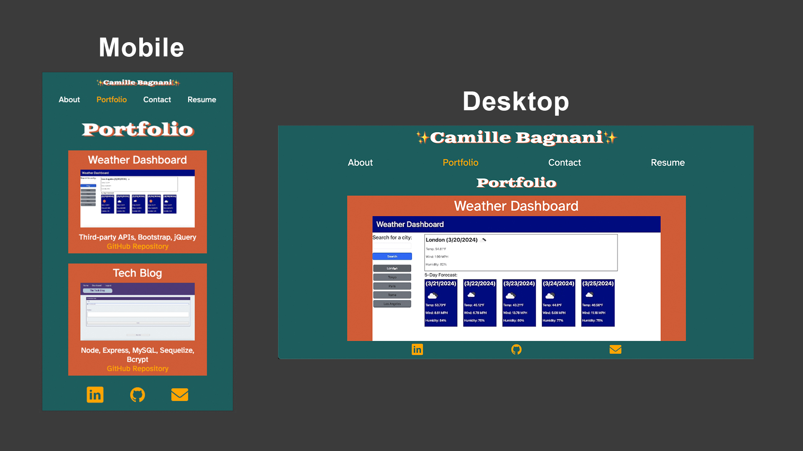

# React Portfolio

## Description
This is my portfolio I built using React! It is designed to showcase my skills as a full stack web developer. This project taught me: 
* How to start a React project using Vite
* How to import and begin using React hooks such as useState and useRef
* How to use NavLink from React Router DOM to create a dynamic single page app with a functioning navigation bar
* How to organize components and reuse them on various pages
* How to use media queries for a responsive, mobile-first design
* Form validation through helper functions and the useRef hook
* How to work with props
* and more

You can view my deployed portfolio here:

## Installation
Vite: https://www.npmjs.com/package/vite

React Router DOM: https://www.npmjs.com/package/react-router-dom

## Usage

## Credits
React Docs: https://react.dev/learn

React Router Docs: https://reactrouter.com/en/main

Form Field Can't Be Empty: https://www.codeguage.com/courses/react/forms-cant-be-empty-exercise

## License
n/a
